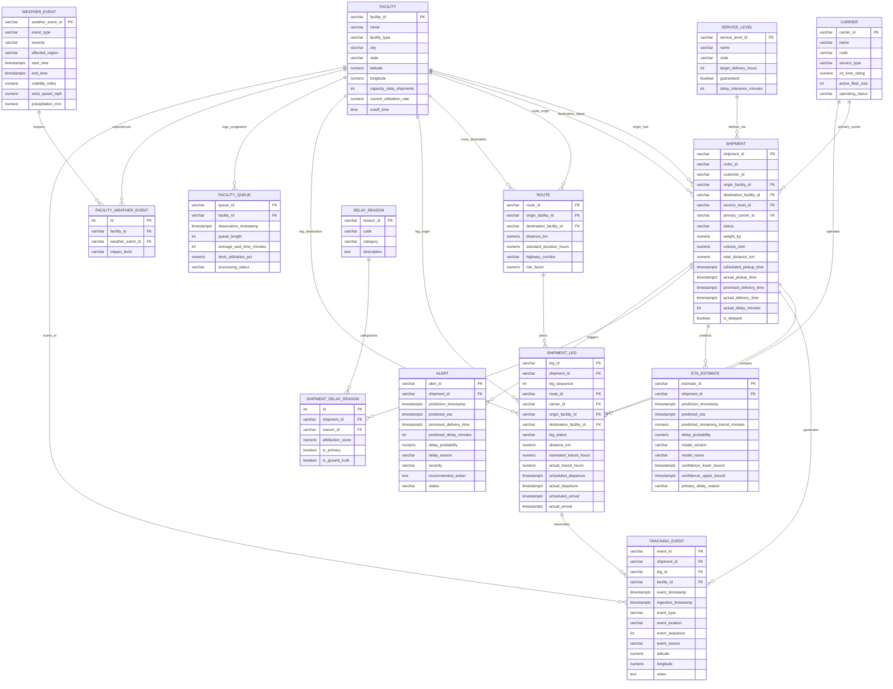

# Entity Relationship Diagram (ERD)

## Visual Model

The diagram below illustrates the relational structure, cardinality, foreign keys, and bridge tables across all logistics entities.

```mermaid
erDiagram
    SERVICE_LEVEL ||--o{ SHIPMENT : defines_sla
    CARRIER ||--o{ SHIPMENT : primary_carrier
    CARRIER ||--o{ SHIPMENT_LEG : operates
    FACILITY ||--o{ SHIPMENT : origin_hub
    FACILITY ||--o{ SHIPMENT : destination_depot
    FACILITY ||--o{ ROUTE : route_origin
    FACILITY ||--o{ ROUTE : route_destination
    FACILITY ||--o{ SHIPMENT_LEG : leg_origin
    FACILITY ||--o{ SHIPMENT_LEG : leg_destination
    FACILITY ||--o{ FACILITY_QUEUE : logs_congestion
    FACILITY ||--o{ FACILITY_WEATHER_EVENT : experiences
    WEATHER_EVENT ||--o{ FACILITY_WEATHER_EVENT : impacts
    ROUTE ||--o{ SHIPMENT_LEG : plans
    SHIPMENT ||--|{ SHIPMENT_LEG : contains
    SHIPMENT ||--o{ TRACKING_EVENT : generates
    SHIPMENT_LEG ||--o{ TRACKING_EVENT : associates
    FACILITY ||--o{ TRACKING_EVENT : scans_at
    SHIPMENT ||--o{ ETA_ESTIMATE : predicts
    SHIPMENT ||--o{ SHIPMENT_DELAY_REASON : links
    DELAY_REASON ||--o{ SHIPMENT_DELAY_REASON : categorizes
    SHIPMENT ||--o{ ALERT : triggers

    SERVICE_LEVEL {
        varchar service_level_id PK
        varchar name
        varchar code
        int target_delivery_hours
        boolean guaranteed
        int delay_tolerance_minutes
    }

    CARRIER {
        varchar carrier_id PK
        varchar name
        varchar code
        varchar service_type
        numeric on_time_rating
        int active_fleet_size
        varchar operating_status
    }

    FACILITY {
        varchar facility_id PK
        varchar name
        varchar facility_type
        varchar city
        varchar state
        numeric latitude
        numeric longitude
        int capacity_daily_shipments
        numeric current_utilization_rate
        time cutoff_time
    }

    ROUTE {
        varchar route_id PK
        varchar origin_facility_id FK
        varchar destination_facility_id FK
        numeric distance_km
        numeric standard_duration_hours
        varchar highway_corridor
        numeric risk_factor
    }

    SHIPMENT {
        varchar shipment_id PK
        varchar order_id
        varchar customer_id
        varchar origin_facility_id FK
        varchar destination_facility_id FK
        varchar service_level_id FK
        varchar primary_carrier_id FK
        varchar status
        numeric weight_kg
        numeric volume_cbm
        numeric total_distance_km
        timestamptz scheduled_pickup_time
        timestamptz actual_pickup_time
        timestamptz promised_delivery_time
        timestamptz actual_delivery_time
        int actual_delay_minutes
        boolean is_delayed
    }

    SHIPMENT_LEG {
        varchar leg_id PK
        varchar shipment_id FK
        int leg_sequence
        varchar route_id FK
        varchar carrier_id FK
        varchar origin_facility_id FK
        varchar destination_facility_id FK
        varchar leg_status
        numeric distance_km
        numeric estimated_transit_hours
        numeric actual_transit_hours
        timestamptz scheduled_departure
        timestamptz actual_departure
        timestamptz scheduled_arrival
        timestamptz actual_arrival
    }

    TRACKING_EVENT {
        varchar event_id PK
        varchar shipment_id FK
        varchar leg_id FK
        varchar facility_id FK
        timestamptz event_timestamp
        timestamptz ingestion_timestamp
        varchar event_type
        varchar event_location
        int event_sequence
        varchar event_source
        numeric latitude
        numeric longitude
        text notes
    }

    FACILITY_QUEUE {
        varchar queue_id PK
        varchar facility_id FK
        timestamptz observation_timestamp
        int queue_length
        int average_wait_time_minutes
        numeric dock_utilization_pct
        varchar processing_status
    }

    WEATHER_EVENT {
        varchar weather_event_id PK
        varchar event_type
        varchar severity
        varchar affected_region
        timestamptz start_time
        timestamptz end_time
        numeric visibility_miles
        numeric wind_speed_mph
        numeric precipitation_mm
    }

    FACILITY_WEATHER_EVENT {
        int id PK
        varchar facility_id FK
        varchar weather_event_id FK
        varchar impact_level
    }

    DELAY_REASON {
        varchar reason_id PK
        varchar code
        varchar category
        text description
    }

    SHIPMENT_DELAY_REASON {
        int id PK
        varchar shipment_id FK
        varchar reason_id FK
        numeric attribution_score
        boolean is_primary
        boolean is_ground_truth
    }

    ETA_ESTIMATE {
        varchar estimate_id PK
        varchar shipment_id FK
        timestamptz prediction_timestamp
        timestamptz predicted_eta
        numeric predicted_remaining_transit_minutes
        numeric delay_probability
        varchar model_version
        varchar model_name
        timestamptz confidence_lower_bound
        timestamptz confidence_upper_bound
        varchar primary_delay_reason
    }

    ALERT {
        varchar alert_id PK
        varchar shipment_id FK
        timestamptz prediction_timestamp
        timestamptz predicted_eta
        timestamptz promised_delivery_time
        int predicted_delay_minutes
        numeric delay_probability
        varchar delay_reason
        varchar severity
        text recommended_action
        varchar status
    }
```
